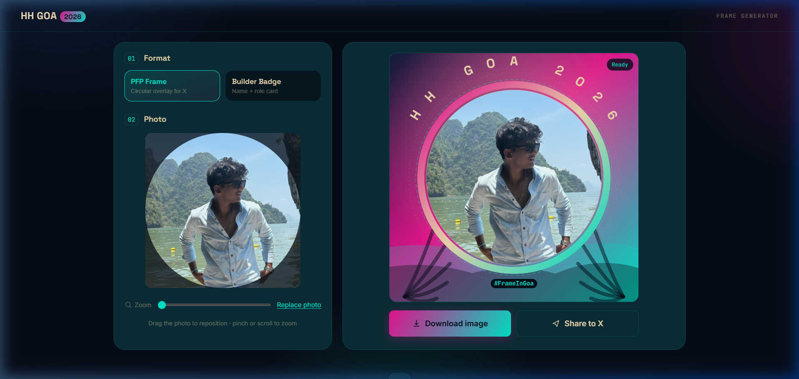
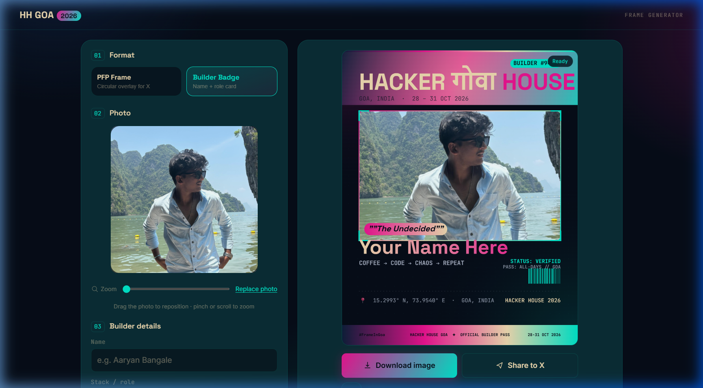

<div align="center">

# 🏝️ HH Goa 2026 — Builder ID Card Generator

Create a polished, presentation-ready builder ID card for Hacker House Goa 2026 in seconds.

[Live Demo](https://hh-goa-2026-generator-rho.vercel.app) • [GitHub](https://github.com/aaryanbangale2306/Frame-Generator-HH-Goa)

</div>

## What it does

This project lets you upload a photo, add your name and role, and generate a clean builder ID card directly in the browser.

### Features
- Upload JPG, PNG, or HEIC images
- Drag, zoom, and reposition the photo
- Generate a premium preview in real time
- Download the final card as a PNG

## Screenshots

### 1. Landing experience


### 2. Photo controls


### 3. Builder details


### 4. Final card preview


## Run locally

```bash
git clone https://github.com/aaryanbangale2306/Frame-Generator-HH-Goa.git
cd Frame-Generator-HH-Goa
py -m http.server 8000
```

Then open http://localhost:8000 in your browser.

## Tech stack

- HTML
- CSS
- Vanilla JavaScript
- Canvas rendering
- HEIC support via heic2any

## Deployment

Live at: https://hh-goa-2026-generator-rho.vercel.app
