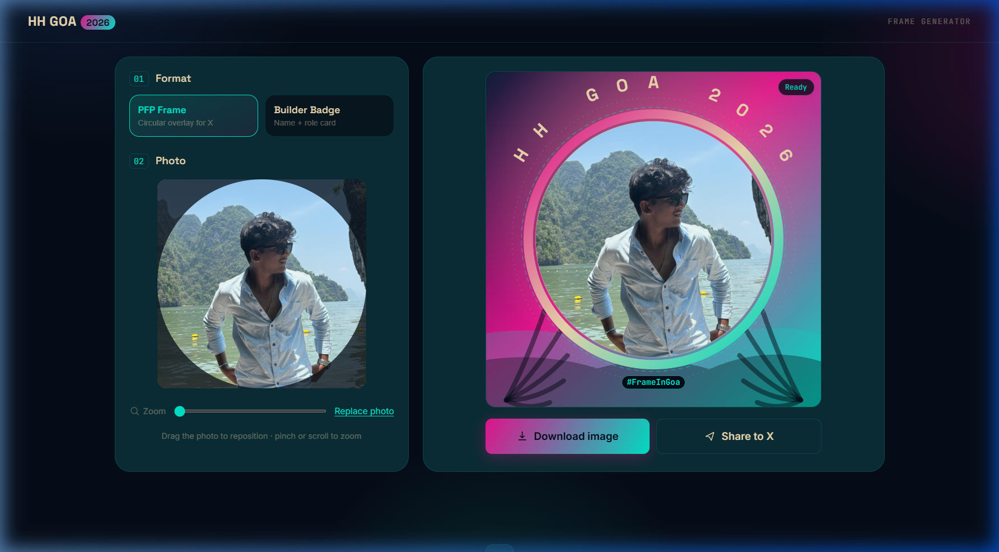

<div align="center">

# 🏝️ HH Goa 2026 — Frame & ID Card Generator

**Turn your photo into a branded HH Goa 2026 graphic in seconds.**
No login. No signup. No server. Pure browser magic.

[](https://hh-goa-2026-generator.vercel.app)
[](https://github.com/aaryanbangale/hh-goa-2026-generator)
[](LICENSE)

</div>

---

## ✨ What it does

Upload your photo → pick a format → download and post. Two shareable graphics, zero friction:

| Format | Output | Size |
|--------|--------|------|
| 🟣 **PFP Frame** | Circular X profile picture overlay with "HH GOA 2026" arc text, gradient ring, and `#FrameInGoa` pill | 1080 × 1080 px |
| 🎫 **Builder Badge** | Full event pass — name, role, builder title, barcode, Goa coordinates, gradient header | 1080 × 1350 px |

---

## 📸 Screenshots

### Landing Page


---

### PFP Frame Mode
Circular profile frame with the Goa horizon gradient, dashed scan ring, and arced "HH GOA 2026" typography.



---

### Builder Badge Mode
Full event-pass style card with name, stack tagline, builder title pill, barcode, and date/location strip.


---

### Controls Panel
Three-step flow: pick format → upload/crop photo → enter builder details.


---

### Photo Crop & Reposition
Live canvas crop previewer — drag to pan, scroll/pinch to zoom. Works with portrait, landscape, or extreme panoramic photos.


---

## 🎨 Design System

The brand identity is built from Goa's own palette — **a dusk horizon over the Arabian Sea**:

```
Ink navy   #060D18  ← background
Deep teal  #0B2D35  ← card surfaces
Magenta    #E91490  ← primary accent / badges
Aqua       #00E5C9  ← CTAs / data highlights
Sand       #EDD9B0  ← typography on dark
```

**Type stack:**
- `Space Grotesk` — display headings and card titles
- `JetBrains Mono` — data, tags, badge numbers, hashtag (nods to the builder culture)
- `Inter` — UI body copy

**Signature motifs:**
- Dashed scan ring around the frame photo
- Viewfinder corner brackets on the builder badge photo
- Ticket-perforation dashed line + barcode strip on the badge
- Gradient horizon (violet → magenta → aqua) shared by both formats

---

## 🚀 Features

### 📷 Smart Photo Handling
- **Cover-fit crop** — always fills the target area, no letterboxing
- **Drag to reposition** — works on mouse and touch
- **Pinch to zoom** — native two-finger on mobile, scroll-wheel on desktop
- **Zoom slider** — fine-tune from 1× to 3×
- **HEIC/iPhone photos** — converts automatically via `heic2any` CDN (loaded on demand, no cost if unused)
- **Resolution-independent** — same pan/zoom renders identically at preview size and full 1080px export

### 🤖 Builder Title Generator
Algorithmically generates a personalised title based on your name + stack:

| Stack keywords | Example titles |
|---|---|
| `react`, `vue`, `css` | *Pixel Pusher · Div Whisperer · Flexbox Diplomat* |
| `ai`, `ml`, `llm` | *Prompt Alchemist · Token Wrangler · Hallucination Herder* |
| `devops`, `docker` | *YAML Sherpa · Container Whisperer · Uptime Guardian* |
| `full-stack` | *Both-Ends Bandit · Swiss Army Dev* |
| *(any)* | *Bug Whisperer · Ship-It Specialist · Midnight-Deploy Veteran* |

Hit **shuffle ↻** to cycle through alternatives — deterministic per name/role/seed so the same combo always resolves to the same pool.

### 📤 Download & Share
- **Download** — real PNG file via `canvas.toBlob` → object URL
- **Share to X (primary)** — `Web Share API` with the image file attached directly (iOS/Android native)
- **Share to X (fallback)** — auto-downloads the image + opens a pre-filled tweet intent with `#FrameInGoa`

---

## 📁 File Map

```
hh-goa-2026-generator/
├── index.html          ← structure, meta/OG tags, control panel + preview markup
├── styles.css          ← design tokens, responsive layout, sticky mobile action bar
├── app.js              ← upload/HEIC, crop interaction, canvas render for both formats,
│                          builder-title generator, download, share
├── og-fallback.png     ← static banner for the tool's own link preview
├── vercel.json         ← Vercel static deploy config
└── screenshots/        ← documentation screenshots
    ├── landing.png
    ├── pfp-frame.png
    ├── builder-badge.png
    ├── controls.png
    └── crop-preview.png
```

---

## 📱 Mobile Experience

The app is optimised for mobile — where most users will be:

- **Sticky action bar** — Download & Share always pinned at the bottom of the screen
- **Preview-first layout** — canvas output shown at top on small screens, controls below
- **Auto-scroll** — after photo upload or format switch, preview scrolls into view automatically
- **Larger crop stage** — up to `min(90vw, 320px)` for comfortable drag-and-drop
- **Web Share API** — on mobile, tapping "Share to X" attaches the PNG directly to the OS share sheet (includes X natively)
- **Safe-area insets** — supports iPhone notch and home-bar padding

---

## ⚡ How to run locally

```bash
# Clone the repo
git clone https://github.com/aaryanbangale/hh-goa-2026-generator.git
cd hh-goa-2026-generator

# Serve with any static server — no build step needed
npx http-server . -p 8080
# Then open http://localhost:8080
```

Or just double-click `index.html` in your browser (file:// works for everything except the HEIC CDN fallback, which needs a real URL).

---

## 🌐 Deploy

### Vercel (recommended — already configured)
```bash
npm i -g vercel
vercel
```
The included `vercel.json` configures Vercel to serve this as a static site. One command, done.

### Any static host
Drop the four files (`index.html`, `styles.css`, `app.js`, `og-fallback.png`) onto any CDN or static host (GitHub Pages, Netlify, Cloudflare Pages, etc.) — no build step, no Node runtime needed.

---

## 🔍 Technical notes

### Why no server?
The entire render pipeline runs in `<canvas>` — synchronous, no ML, no round-trips. Every change (photo pan, name input, format toggle, shuffle) re-draws through a single `requestAnimationFrame`-batched `render()` call. It's continuous and instant rather than a "Generate" button with a spinner.

### On the OG-image requirement
The static `og-fallback.png` + meta tags cover the case where the *tool itself* gets shared. True per-user OG image links (share a URL, the link's `og:image` shows *that person's* card) require a server that stores the generated PNG and serves dynamic `<meta property="og:image">` tags — a deliberate out-of-scope for this static, no-login tool. The concrete next step: a single serverless endpoint (`POST /render` → composite on `node-canvas` → store → return short-lived URL).

### Resolution independence
The crop model stores position as a **fraction** (`panX`, `panY` ∈ [0,1] of the "excess" scrollable space) rather than raw pixels, so the 300px crop preview and the 1080px PNG output always render identically. No drift between what you see and what you get.

---

## 🏗️ Built for

[**Hacker House Goa 2026**](https://hackerhousegoa.com) — a builder-focused hackathon in Goa, India. **28–31 Oct 2026** · 📍 15.2993° N, 73.9540° E

---

<div align="center">

Made with ☕ + late nights by **[@aaryanbangale](https://github.com/aaryanbangale)**

*Ship fast. Frame yourself. See you in Goa.* 🏝️

</div>
